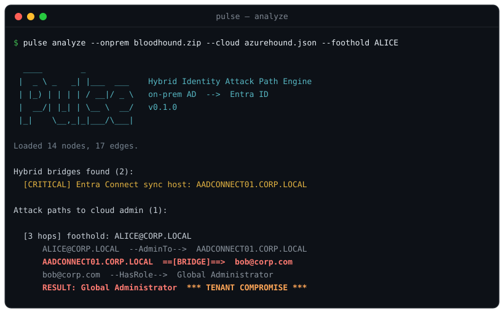

# Pulse — Hybrid Identity Attack Path Engine

> **See how your on-prem compromise becomes a cloud compromise — in minutes, not months.**



BloodHound maps on-prem Active Directory. AzureHound maps Entra ID. **Nobody
welds the two together.** Pulse does exactly that: it takes recon you already
collected and shows the shortest path by which an attacker who owns *one*
on-prem box ends up holding **Global Administrator** in your cloud tenant.

That path almost always runs through a bridge the existing tools don't model:
**Entra Connect (AAD Connect) sync, Password Hash Sync, ADFS / Golden SAML,
Seamless SSO.** Pulse is built around those bridges.

```
ALICE@CORP.LOCAL                       (nobody special — local admin on one box)
   --AdminTo-->        AADCONNECT01.CORP.LOCAL
   ==[BRIDGE]==>       bob@corp.com    (sync-server takeover => impersonate any synced user)
   --HasRole-->        Global Administrator     *** TENANT COMPROMISE ***
```

## Why this, and why now

- **Hybrid is the default.** Most orgs in 2026 run on-prem AD *and* Entra ID,
  and no single tool tells them how identity weaknesses chain across the two.
- **The gap is the bridge.** Attackers walk on-prem → sync server → cloud admin.
  Defenders need to know which bridge to harden *first*.
- **Dual-use by design.** The same graph that scares a red team into action
  tells a blue team exactly where to cut the path.

## Passive and authorized — by design

Pulse **never touches a live target.** It only reasons over data already
collected by established, authorized tools:

| Realm    | Collector              | Pulse adapter            |
|----------|------------------------|--------------------------|
| On-prem  | SharpHound             | `pulse.ingest.sharphound`|
| Cloud    | AzureHound / ROADrecon | `pulse.ingest.azurehound`|

Use Pulse **only** against tenants/domains you own or are explicitly
authorized to assess.

## Where Pulse fits in an engagement

Pulse runs on **your** analysis machine, **after** collection, **offline**.

```
1. AUTHORIZE   written permission / engagement scope
2. COLLECT     run SharpHound (on-prem) + AzureHound (Entra)   <- these query the target, read-only
                  -> 20240609_bloodhound.zip , azurehound.json
3. ANALYZE     copy those files to your box and run Pulse      <- THIS step. zero packets to the target
                  pulse analyze --onprem 2024..zip --cloud azurehound.json
4. REPORT      hand the client the path + the one fix          <- "harden AADCONNECT01 / this sync account"
```

- **Who:** pentesters / red teams during an assessment, and blue/purple teams
  auditing their own hybrid identity.
- **Where:** the operator's laptop or VM — never installed on the client's DC or
  tenant. Pulse only reads files that were already collected.
- **When:** in the analysis/reporting phase. It can be re-run any time, on a
  plane, with no network — and re-run after a fix to confirm the path is gone.

## Installation

Pulse is pure Python (**3.9+**) with **no third-party dependencies**.

**Option A — install the CLI (recommended)**

```bash
pip install git+https://github.com/FortisFortuna-br/pulse-ad.git
```

This installs a `pulse` command:

```bash
pulse --version
pulse analyze --onprem <sharphound> --cloud <azurehound>
```

If your shell can't find `pulse` afterwards, Python's scripts directory isn't on
your PATH (common on Windows user installs). Add it, or just use the
always-works form `python -m pulse ...`.

**Option B — run from source (clone, no install)**

```bash
git clone https://github.com/FortisFortuna-br/pulse-ad.git
cd pulse-ad
python -m pulse --version
```

The source clone also ships the `samples/` used in the Quick start below.
(A PyPI release — `pip install pulse-ad` — is planned.)

## Quick start

> Examples use `python -m pulse` (works from a clone). If you installed via
> pip, the `pulse` command works identically.

```bash
python -m pulse analyze \
    --onprem samples/onprem \
    --cloud  samples/cloud_azurehound.json
```

`--onprem` accepts a SharpHound `.zip`, a directory of collection `.json`
files, or a single file. `--cloud` takes the Entra/AzureHound export.

Pin a starting foothold, or get machine-readable output:

```bash
python -m pulse analyze --onprem samples/onprem --cloud samples/cloud_azurehound.json --foothold ALICE
python -m pulse analyze --onprem samples/onprem --cloud samples/cloud_azurehound.json --format json
```

Summarize the graph and the tenant's exposure (how many on-prem users can reach
cloud admin):

```bash
python -m pulse stats --onprem samples/onprem --cloud samples/cloud_azurehound.json
```

Export the graph for visualization (Graphviz / Gephi / yEd) — bridge edges are
drawn bold red:

```bash
python -m pulse export --onprem samples/onprem --cloud samples/cloud_azurehound.json --format dot -o graph.dot
python -m pulse export --onprem samples/onprem --cloud samples/cloud_azurehound.json --format graphml -o graph.graphml
```

Run the tests:

```bash
pip install -e ".[dev]"
pytest -q
```

## Product model

Pulse ships in two editions:

- **Pulse Community** — open source, the core graph + bridge engine. The funnel
  and the learning vehicle.
- **Pulse** (closed source, advanced) — richer bridge coverage (ADFS Golden
  SAML, Seamless SSO, PTA, app-registration abuse), reporting, and continuous
  posture tracking. Paid: **7-day trial, then a flat $100** to install. No
  free / pro / enterprise tier maze — one product, one price.

> Community-edition license: **MIT** — see [LICENSE](LICENSE).

## Roadmap

- **Slice 1 (done):** core graph, ingest, foundational bridges, shortest-path, CLI.
- **Slice 2 (done):** real multi-file / zip SharpHound ingest (LocalAdmins,
  Sessions, ACLs incl. DCSync rights); data-driven bridge detection — sync
  account, sync host, and DCSync-capable principals found with no manual flags.
- **Slice 3 (done):** real AzureHound ingest (`{kind, data}` envelope, role
  assignments); `--format json` for analyze/stats; `stats` command with tenant
  exposure; `export` to DOT / GraphML with bridge edges highlighted.
- **Slice 3:** more bridges — ADFS token-signing (Golden SAML), Seamless SSO
  (`AZUREADSSOACC$`), PTA agent, app registrations with on-prem-synced owners.
- **Slice 4:** HTML/PDF reporting with the bridge hop highlighted + remediation.
- **Slice 5:** packaging (trial gate + licensing) for the paid edition.
